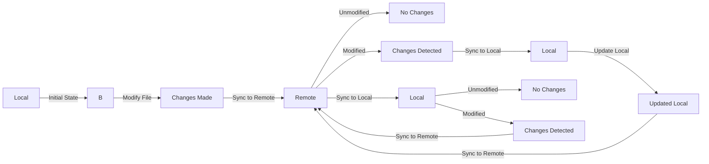

# New design

The original design aimed to handle file synchronization using four distinct statuses:
1. `PxRemoteFileStatus`: This represents the status of the remote file.
2. `PxLocalFileStatus`: This reflects the local file status following the last synchronization.  
3. `PxCurrentFileStatus`: This is the current status of the data file.  
4. `PxBackupFileStatus`: This status is used to track the backup file.
Due to the complexity of the old design, a new design is proposed to address these concerns.

## Using Git remotely through SSH

The main design concept is to use Git for distributed data synchronization. Due to the inherent difficulties in setting up Git directly on mobile platforms like Android or iOS, a common approach is to host the Git workspace on a server. This allows for remote operations on the workspace using SSH.

The new version of PassXYZLib will be updated to 2.2.x.

## Changes of `ICloudServices`

Since it is difficult to implement Git on all devices, we will use Git remotely.
Added `SynchronizeAsync` to simplify the synchronization.

### How to detect local and remote file changes?

The property `IsModified` of `PxFileStatus` is used to detect changes.

#### Local file changes

Local file can be changed at any time. If the `Length` or `LastWriteTime` is different between local file and remote file, the local file is changed.

#### Remote file changes

Remote file may be changed when we pull from remote repository. The remote change can be detected using Git status.

`public class PxRemoteUser : PxUser`

---
Creating mermaid diagram at:
https://mermaid.live/